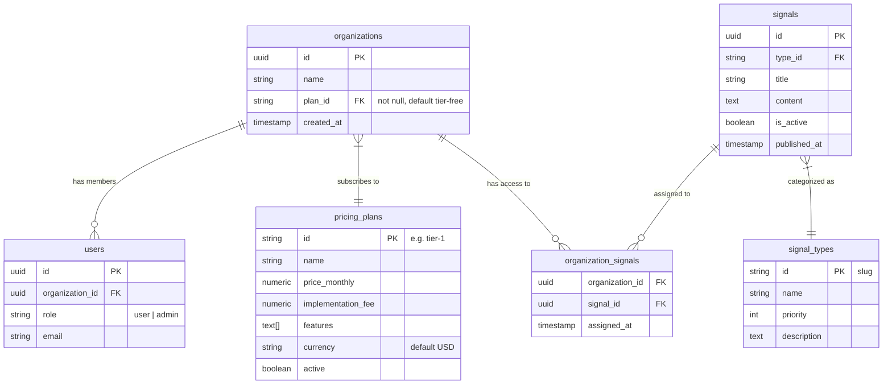

# Database Entity Relationship Diagram (ERD)

This document visualizes the relationships between the core entities in the Sota Platform database.

## Security Model (RLS)
-   **Users** can only see their own **Organization**.
-   **Users** can only see **Signals** that are linked to their Organization via `organization_signals`.
-   **Admins** have full access to all tables.
