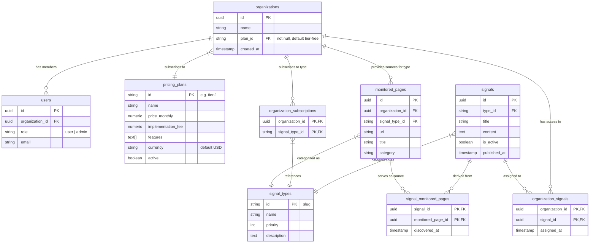

# Database Entity Relationship Diagram (ERD)

This document visualizes the relationships between the core entities in the Sota Platform database.

```mermaid
erDiagram
    %% Core Tenant Entities
    organizations ||--o{ users : "has members"
    organizations }|--|| pricing_plans : "subscribes to"

    %% Signal Entities
    signals }|--|| signal_types : "categorized as"
    
    %% Monitoring Entities
    organizations ||--o{ organization_subscriptions : "subscribes to type"
    organization_subscriptions }|--|| signal_types : "references"
    organizations ||--o{ monitored_pages : "provides sources for type"
    monitored_pages }|--|| signal_types : "categorized as"
    signals ||--o{ signal_monitored_pages : "derived from"
    monitored_pages ||--o{ signal_monitored_pages : "serves as source"

    %% Relationships logic
    organizations ||--o{ organization_signals : "has access to"
    signals ||--o{ organization_signals : "assigned to"

    %% Table Definitions
    organizations {
        uuid id PK
        string name
        string plan_id FK "not null, default tier-free"
        timestamp created_at
    }

    users {
        uuid id PK
        uuid organization_id FK
        string role "user | admin"
        string email
    }

    monitored_pages {
        uuid id PK
        uuid organization_id FK
        string signal_type_id FK
        string url
        string title
        string category
    }

    organization_subscriptions {
        uuid organization_id PK, FK
        string signal_type_id PK, FK
    }

    signal_monitored_pages {
        uuid signal_id PK, FK
        uuid monitored_page_id PK, FK
        timestamp discovered_at
    }

    pricing_plans {
        string id PK "e.g. tier-1"
        string name
        numeric price_monthly
        numeric implementation_fee
        text[] features
        string currency "default USD"
        boolean active
    }

    signals {
        uuid id PK
        string type_id FK
        string title
        text content
        boolean is_active
        timestamp published_at
    }

    signal_types {
        string id PK "slug"
        string name
        int priority
        text description
    }

    organization_signals {
        uuid organization_id PK, FK
        uuid signal_id PK, FK
        timestamp assigned_at
    }
```

## Signal Evidence Flow

The platform follows a structured flow from raw sources to delivered insights:

1.  **Subscription (`organization_subscriptions`)**: Organizations declare their interest in specific global signal types (e.g., Coal Co follows "Pricing").
2.  **Organization Sources (`monitored_pages`)**: Organizations provide their specific URLs to monitor for that type. This ensures isolation (e.g., Coal Co monitors mining indices, AI SaaS monitors LLM pricing).
3.  **Analysis & Creation (`signals`)**: Analysis is performed based on those specific sources to generate a Signal.
4.  **Evidence Linking (`signal_monitored_pages`)**: The resulting Signal is linked back to the specific source URLs used in the analysis.
5.  **Delivery (`organization_signals`)**: The Signal is delivered to the organization's dashboard.

## Security Model (RLS)
-   **Users** can only see their own **Organization**.
-   **Users** can only see **Signals** that are linked to their Organization via `organization_signals`.
-   **Admins** have full access to all tables.
